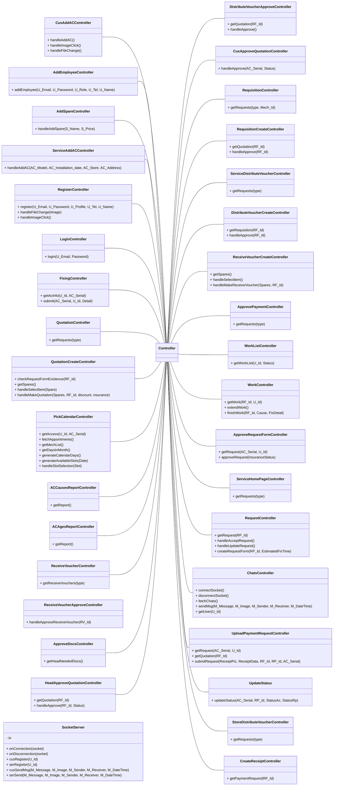

```mermaid
classDiagram
    direction LR
    
    %% Left side classes
    class CusAddACController {
        + handleAddAC()
        + handleImageClick()
        + handleFileChange()
    }
    class AddEmployeeController {
        + addEmployee(U_Email, U_Password, U_Role, U_Tel, U_Name)
    }
    class AddSpareController {
        + handleAddSpare(S_Name, S_Price)
    }
    class ServiceAddACController {
        + handleAddAC(AC_Model, AC_Installation_date, AC_Store, AC_Address)
    }
    class RegisterController {
        + register(U_Email, U_Password, U_Profile, U_Tel, U_Name)
        + handleFileChange(Image)
        + handleImageClick()
    }
    class LoginController {
        + login(U_Email, Password)
    }
    class FixingController {
        + getAcInfo(U_Id, AC_Serial)
        + submit(AC_Serial, U_Id, Detail)
    }
    class QuotationController {
        + getRequests(type)
    }
    class QuotationCreateController {
        + checkRequestFormExistence(RF_Id)
        + getSpares()
        + handleSelectItem(Spare)
        + handleMakeQuotation(Spares, RF_Id, discount, insurance)
    }
    class PickCalendarController {
        + getAccess(U_Id, AC_Serial)
        + fetchAppointments()
        + getMechList()
        + getDaysInMonth()
        + generateCalendarDays()
        + generateAvailableSlots(Date)
        + handleSlotSelection(Slot)
    }
    class ACCausesReportController {
        + getReport()
    }
    class ACAgesReportController {
        + getReport()
    }
    class ReceiveVoucherController {
        + getReceiveVouchers(type)
    }
    class ReceiveVoucherApproveController {
        + handleApproveReceiveVoucher(RV_Id)
    }
    class ApproveDocsController {
        + getHeadNeededDocs()
    }
    class HeadApproveQuotationController {
        + getQuotation(RF_Id)
        + handleApprove(RF_Id, Status)
    }
    class SocketServer {
        - io
        + onConnection(socket)
        + onDisconnection(socket)
        + cusRegister(U_Id)
        + serRegister(U_Id)
        + cusSendMsg(M_Message, M_Image, M_Sender, M_Receiver, M_DateTime)
        + serSend(M_Message, M_Image, M_Sender, M_Receiver, M_DateTime)
    }

    %% Center class
    class Controller

    %% Right side classes
    class StoreDistributeVoucherController {
        + getRequests(type)
    }
    class DistributeVoucherApproveController {
        + getQuotation(RF_Id)
        + handleApprove()
    }
    class CusApproveQuotationController {
        + handleApprove(AC_Serial, Status)
    }
    class RequisitionController {
        + getRequests(type, Mech_Id)
    }
    class RequisitionCreateController {
        + getQuotation(RF_Id)
        + handleApprove(RF_Id)
    }
    class ServiceDistributeVoucherController {
        + getRequests(type)
    }
    class DistributeVoucherCreateController {
        + getRequisition(RF_Id)
        + handleApprove(RF_Id)
    }
    class ReceiveVoucherCreateController {
        + getSpares()
        + handleSelectItem()
        + handleMakeReceiveVoucher(Spares, RF_Id)
    }
    class ApprovePaymentController {
        + getRequests(type)
    }
    class CreateReceiptController {
        + getPaymentRequest(RF_Id)
    }
    class WorkListController {
        + getWorkList(U_Id, Status)
    }
    class WorkController {
        + getWork(RF_Id, U_Id)
        + extendWork()
        + finishWork(RF_Id, Cause, FixDetail)
    }
    class ApproveRequestFormController {
        + getRequest(AC_Serial, U_Id)
        + approveRequest(InsuranceStatus)
    }
    class ServiceHomePageController {
        + getRequests(type)
    }
    class RequestController {
        + getRequest(RP_Id)
        + handleAcceptRequest()
        + handleUpdateRequest()
        + createRequestForm(RP_Id, EstimatedFixTime)
    }
    class ChatsController {
        + connectSocket()
        + disconnectSocket()
        + fetchChats()
        + sendMsg(M_Message, M_Image, M_Sender, M_Receiver, M_DateTime)
        + getUser(U_Id)
    }
    class UploadPaymentRequestController {
        + getRequest(AC_Serial, U_Id)
        + getQuotation(RF_Id)
        + submitRequest(ReceiptPic, ReceiptData, RF_Id, RP_Id, AC_Serial)
    }
    class UpdateStatus {
        + updateStatus(AC_Serial, RP_Id, StatusAc, StatusRp)
    }

    %% Left side connections
    CusAddACController -- Controller
    AddEmployeeController -- Controller
    AddSpareController -- Controller
    ServiceAddACController -- Controller
    RegisterController -- Controller
    LoginController -- Controller
    FixingController -- Controller
    QuotationController -- Controller
    QuotationCreateController -- Controller
    PickCalendarController -- Controller
    ACCausesReportController -- Controller
    ACAgesReportController -- Controller
    ReceiveVoucherController -- Controller
    ApproveDocsController -- Controller
    HeadApproveQuotationController -- Controller

    %% Right side connections
    Controller -- DistributeVoucherApproveController
    Controller -- CusApproveQuotationController
    Controller -- RequisitionController
    Controller -- RequisitionCreateController
    Controller -- ServiceDistributeVoucherController
    Controller -- DistributeVoucherCreateController
    Controller -- ReceiveVoucherCreateController
    Controller -- ApprovePaymentController
    Controller -- WorkListController
    Controller -- WorkController
    Controller -- ApproveRequestFormController
    Controller -- ServiceHomePageController
    Controller -- RequestController
    Controller -- ChatsController
    Controller -- UploadPaymentRequestController
    Controller -- UpdateStatus
    Controller -- StoreDistributeVoucherController
    Controller -- CreateReceiptController
```