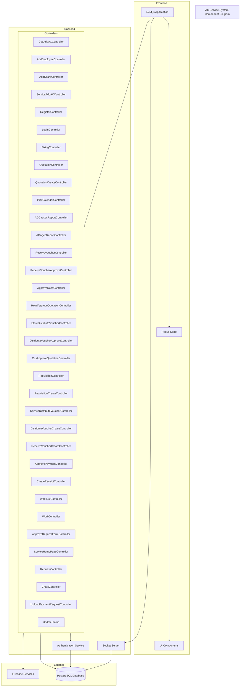

```mermaid
graph TB
    %% Title
    title[AC Service System Component Diagram]

    subgraph Frontend
        nextjs[Next.js Application]
        redux[Redux Store]
        ui[UI Components]
    end

    subgraph Backend
        subgraph Controllers
            CusAddACController
            AddEmployeeController
            AddSpareController
            ServiceAddACController
            RegisterController
            LoginController
            FixingController
            QuotationController
            QuotationCreateController
            PickCalendarController
            ACCausesReportController
            ACAgesReportController
            ReceiveVoucherController
            ReceiveVoucherApproveController
            ApproveDocsController
            HeadApproveQuotationController
            StoreDistributeVoucherController
            DistributeVoucherApproveController
            CusApproveQuotationController
            RequisitionController
            RequisitionCreateController
            ServiceDistributeVoucherController
            DistributeVoucherCreateController
            ReceiveVoucherCreateController
            ApprovePaymentController
            CreateReceiptController
            WorkListController
            WorkController
            ApproveRequestFormController
            ServiceHomePageController
            RequestController
            ChatsController
            UploadPaymentRequestController
            UpdateStatus
        end

        socket[Socket Server]
        auth[Authentication Service]
    end

    subgraph External
        db[(PostgreSQL Database)]
        firebase[Firebase Services]
    end

    %% Relationships
    nextjs --> redux
    redux --> ui
    nextjs --> Controllers
    nextjs --> socket
    Controllers --> auth
    Controllers --> db
    Controllers --> firebase
    socket --> db
    auth --> db
```
